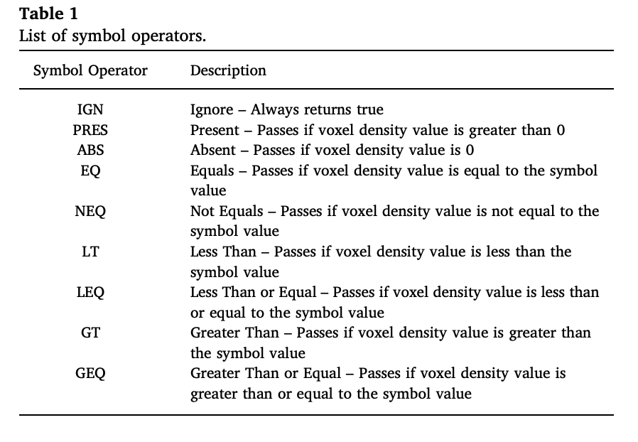
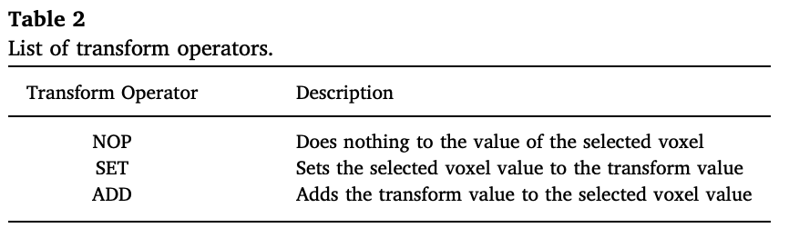
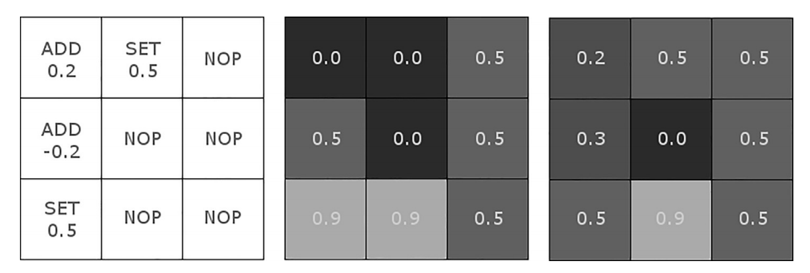
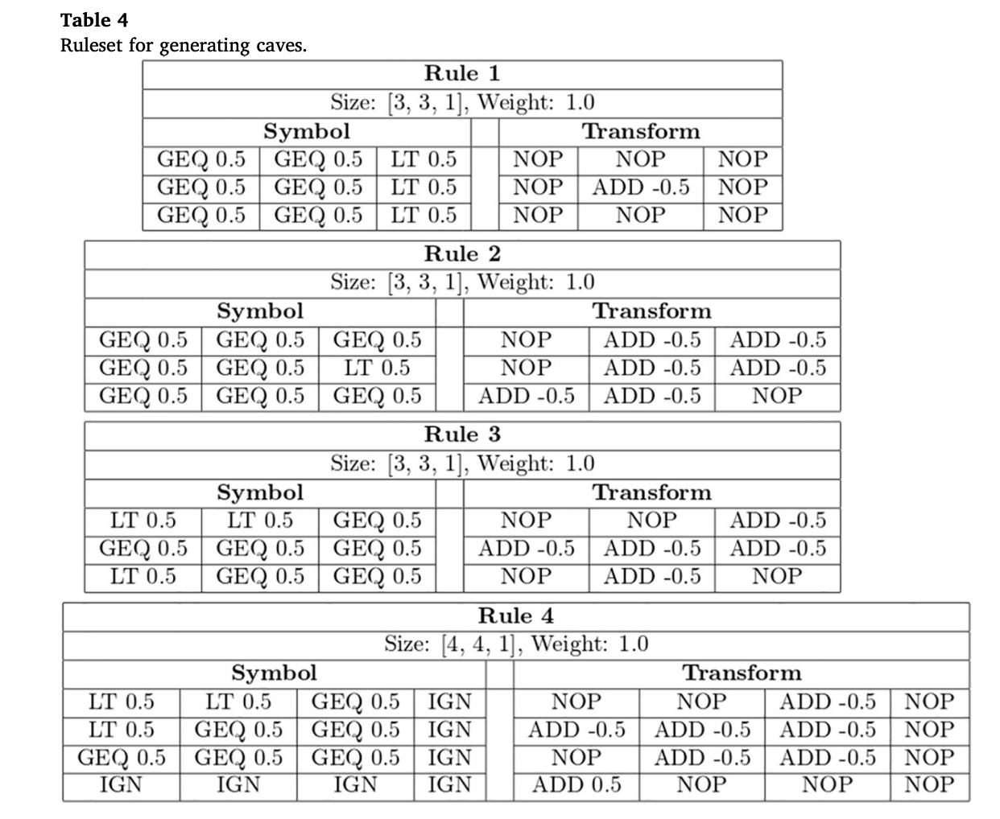
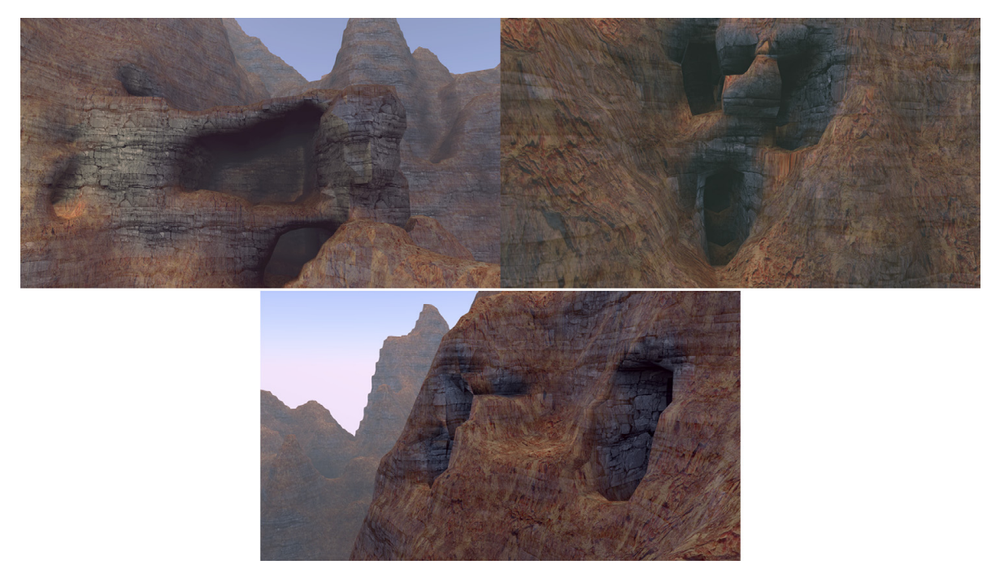
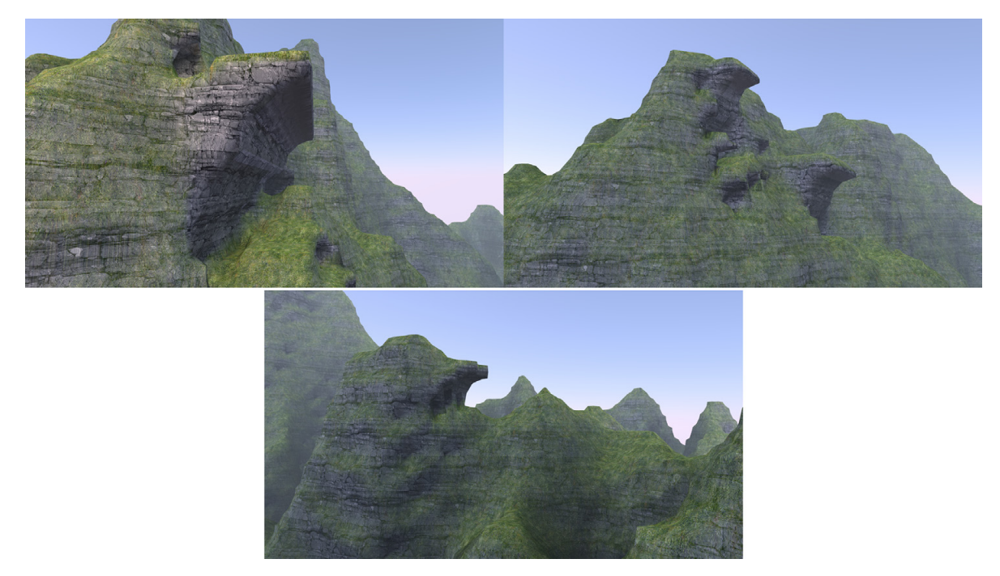
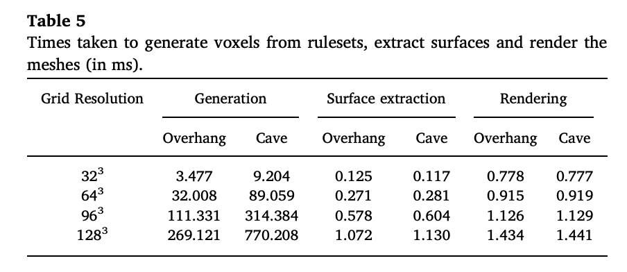

# assignment-2-paper-review-AgusPriyono

Player-Adaptive Spelunky Level Generation

- David Stammer (Hochschule Mannheim) david.stammer@googlemail.com 
- Tobias G¨unther (Cooperative State University Baden-Wuertemberg) tobias.guenther@dhbw-mannheim.de
- Mike Preuss (WWU M¨unster, Germany) mike.preuss@wi.uni-muenster.de

## STRUCTURE
- ABSTRACT
- INTRODUCTION
- RELATED PCG AND DDA WORKS
- SPELUNKY
- PLAYER SURVEY CONCERNING DDA
- DIFFICULTY ESTIMATION AND PLAYING STYLE In
- CONTROLLED LEVEL GENERATION
- USER STUDY 
- CONCLUSION
- REFERENCES

## Abstract
- PCG has been applied to many games today, so it helps level designers to be creative
- Generate level by adjusting the level of difficulty by applying the rule for its adaptive
- The approach is Experience-Driven PCG approach, where generating from the level depends on the experience of the user
- Based on surveys, most people appreciate adaptation, the more important thing is an easy game to play at any time

## Intro
- One of the many studies on AI in games, relates to almost all topics about AI in games, and is increasingly being applied to commercial games [1]
- Spelunky games currently have implemented auto generation, but it does not depend on player performance, and can be frustrating
- Choose the right level and according to the style of the player
- Baghdati [2] makes PCG for spunun generating levels use GA with the Search-based PCG (SBPCG) paradigm [3], but without using DDA (Dynamic Difficulty Adjustment)
- The application of simple adaptation is based on manual rule adjustments, so the process of generating levels is faster
- Using the initial survey, regarding DDA

## PCG and DDA
- DDA is part of the game changed to fit the player, especially the level of difficulty

Spelunky
## Intro

Terrain
- Component for games, simulations, or movies (outdoor environtment)
- Fully automatic or semi-automatic method

Voxel Representation
- Can create rich object like caves and overhangs

PCG
- PCG is a procedural system to create object like texture, geometry, or animation.
- Need for eficient in process, effort, and time (cost effect)
- Help designer to design

Voxel-based approach 
- The presented method expands the concept of shape grammars to a volumetric space

Research 
- Introduce voxel-based approach for generating overhangs and caves
- Create ruleset implemented to voxel
- Create surface using surface net algorithm
- present timings and memory usage from our results for the generation of the voxel data using different rulesets plus the performance statistics of our GPU surface extraction algorithm.
- Collaboration with Sony Interactive Entertainment Euro Research and Development
- Using Phyreengine
- Supported by Nvidia (Titan GPU)

## Voxel Grammar

- Inspired for space automata
- Generated by defined rules
- Manipulate volume recursively, and generated by ruleset as in real world
- Voxel value is representation of material density
- Initial state generated by voxelizing heighfield from 3 octaves 2D Perlin Noise
- Voxel grid processed by sliding window approach, checking whether voxel subset in window have any criteria
- If matching, respective transformation will be executed to foxel repeatly subsequently
- Derivation process is repeated as parameter
- User can define start and end of position in voxel grid

### Rules 

Symbols
- Symbol is a list of conditions in the form of an I × J × K array that determines whether the rule’s transformation will be executed.
- Check the condition, compare data value and input of voxel value
- Consisting operator and data value

Transforms
- A transformation consists of a list of manipulations in an array with the same dimensions as the rule’s symbol and is only applied to the voxel grid when the symbol’s criteria have been fulfilled
- Consisting operator and data value
- voxel density selected is manipulated by determining operator type and data value

Rule Selection 
- Each rule has priority value
- If matching rule is multiple, see priority value
- If priority value is same, rule are selected stochastically

### Grammar Construction

- Observation for understanding effect of component
- The problem is repeat model, it is not natural, solution is to create variant rules, or rule with same symbol, same weight, and noop operator for all
- reduce rule that have ignore symbol for all, bad effect.

### Derivation Process

- 2 stages, rule matching and replacement
- Checking whether rule is matcibg with voxel
- Rule with bigger dimension is found and slicing window to axis
- Voxel in window is recent voxel
- Replacement occurs if rule is completed
- Process continue until all of rule is queried  

## Conclusion

- Metodology is effective in manipulating voxel group.  
