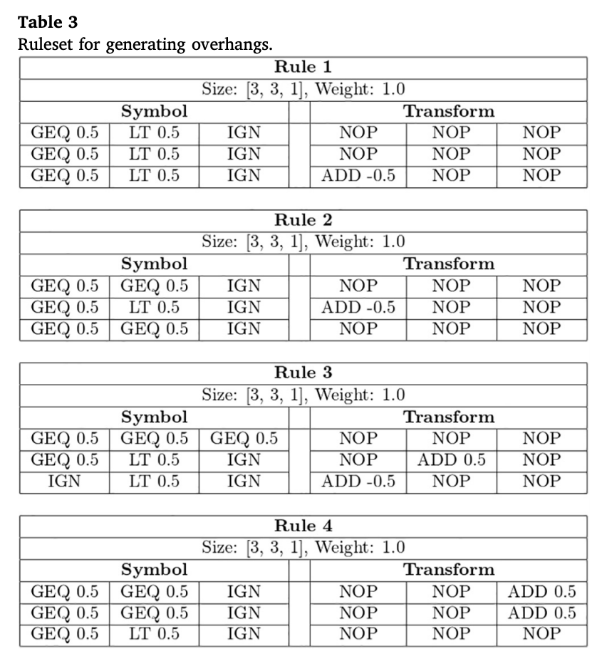

# assignment-2-paper-review-AgusPriyono

Procedural feature generation for volumetric terrains using voxel grammars

Rahul Deya
Jason G. Doiga
Christos Gatzidisb

Sony Interactive Entertainment Euro R&D
Bournemouth University

## Intro

Terrain
For games, simulations, or movies. (outdoor environtment)
Fully automatic or semi-automatic method

Voxel Representation
can create rich object like caves and overhangs

PCG is a procedural system to create object like texture, geometry, or animation.
for eficient in process, effort and time.

voxel-based approach 
The presented method expands the concept of shape grammars to a volumetric space

present timings and memory usage from our results for the generation of the voxel data using different rulesets plus the performance statistics of our GPU surface extraction algorithm. This research has been car

collaboration with Sony Interactive Entertainment Euro Research and Development 

## Voxel Grammar

Symbols
A rule’s symbol is a list of conditions in the form of an I J × × K array that determines whether the rule’s transformation will be executed.

Transforms
A transformation consists of a list of manipulations in an array with the same dimensions as the rule’s symbol and is only applied to the voxel grid when the symbol’s criteria have been fulfilled.

